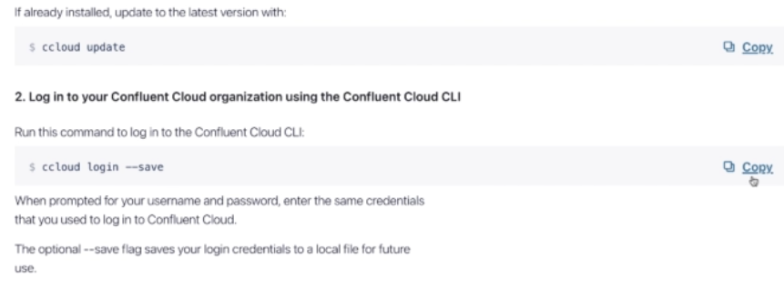
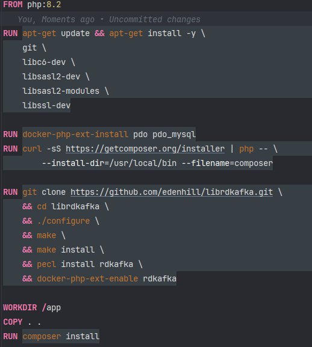

## <p align="center">Apache Kafka Queue Service for Laravel 10.x 11.x</p>

## Required before starting

You should have account for deployment in Google Cloud (https://cloud.google.com) 
create new project and select from marketplace "apache kafka@ on confluent cloud"
and set up for your requirements.

- from Confluent.cloud you should have CLI installation for your server where you will use the kafka 
```bash
curl -L --http1.1 https://cnfl.io/ccloud-cli | sh -s -- -b /usr/local/bin 
```



and at least if you prefer to run under docker, be sure that you have the kafka extension installed and enabled so an example image below;


after you follow all the steps and ready to use the package, follow the steps below;

## Installation

You can install the package via composer:

```bash
composer require siberfx/apache-kafka
```

## Usage

``` php

// config/kafka-config.php file content, you can modify it by your own settings.
return [
    'queue_name' => 'kafka',

    'bootstrap_servers' => env('BOOTSTRAP_SERVER', ''),
    'security_protocol' => env('SECURITY_PROTOCOL', ''),
    'sasl_mechanisms' => env('SASL_MECHANISM', ''),
    'sasl_username' => env('SASL_USERNAME', ''),
    'group_id' => env('GROUP_ID', ''),

];

```

### Publish files

``` bash
php artisan vendor:publish --provider="Siberfx\ApacheKafka\KafkaServiceProvider"
```

### required Kafka Queue Service changes on your app

You can override in which table are located your `"lat, lng"` fields and even the model you want to create the fields
with the help of `config/kafka-config.php` file and `table_name` field if its set already

```

### Security

If you discover any security related issues, please email info@siberfx.com instead of using the issue tracker.

## Credits

- [Selim Gormus](https://github.com/siberfx)

