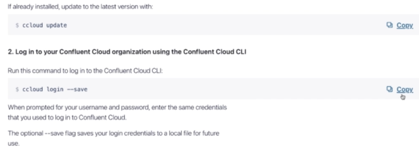
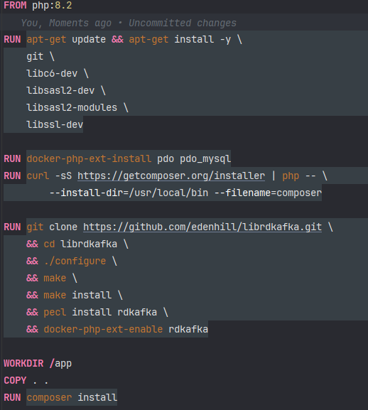

## <p align="center">Apache Kafka Queue Service for Laravel 12.x 13.x</p>

A Laravel queue driver backed by [Apache Kafka](https://kafka.apache.org/) (tested against
[Confluent Cloud](https://www.confluent.io/)). It lets you dispatch Laravel jobs to a Kafka
topic and process them with the standard `queue:work` worker.

## Requirements

- PHP `^8.4`
- Laravel `^12.0 | ^13.0`
- The [`rdkafka`](https://github.com/arnaud-lb/php-rdkafka) PHP extension (built on top of
  [`librdkafka`](https://github.com/confluentinc/librdkafka))
- A reachable Kafka cluster (self-hosted or Confluent Cloud)

## Required before starting

If you are using Confluent Cloud, create an account at https://www.confluent.io/, create a new
project and provision an "Apache Kafka on Confluent Cloud" cluster, then create an API key/secret
that will be used as the SASL username/password below.

```bash
curl -L --http1.1 https://cnfl.io/ccloud-cli | sh -s -- -b /usr/local/bin
```




Make sure the `rdkafka` extension is installed and enabled before installing the package:



## Installation

### 1. Install the `rdkafka` PHP extension

```bash
# install librdkafka first (Debian/Ubuntu)
sudo apt-get update && sudo apt-get install -y librdkafka-dev

# then the PHP extension
pecl install rdkafka

# enable it (add to your php.ini)
echo "extension=rdkafka.so" >> "$(php -i | grep -i 'Loaded Configuration File' | awk '{print $5}')"
```

> A ready-to-use container is provided under [`docker/`](docker/) (PHP 8.4 with `librdkafka` and
> `rdkafka` already compiled). Run it with `docker compose -f docker/docker-compose.yaml up`.

### 2. Require the package via Composer

```bash
composer require siberfx/apache-kafka
```

The service provider (`Siberfx\Kafka\KafkaServiceProvider`) is auto-discovered — no manual
registration required.

## Configuration

### 1. Add a `kafka` connection to `config/queue.php`

The connector reads its settings from the queue connection config. Add the following entry under
`connections`:

```php
'connections' => [

    // ...

    'kafka' => [
        'driver'            => 'kafka',
        'bootstrap_servers' => env('KAFKA_BROKERS', 'localhost:9092'),
        'security_protocol' => env('KAFKA_SECURITY_PROTOCOL', 'SASL_SSL'),
        'sasl_mechanisms'   => env('KAFKA_SASL_MECHANISMS', 'PLAIN'),
        'sasl_username'     => env('KAFKA_SASL_USERNAME', ''),
        'sasl_password'     => env('KAFKA_SASL_PASSWORD', ''),
        'group_id'          => env('KAFKA_GROUP_ID', 'laravel'),
    ],

],
```

### 2. Set your `.env`

```dotenv
QUEUE_CONNECTION=kafka

# default topic used when a job does not specify one
KAFKA_QUEUE=default

KAFKA_BROKERS=pkc-xxxxx.region.provider.confluent.cloud:9092
KAFKA_SECURITY_PROTOCOL=SASL_SSL
KAFKA_SASL_MECHANISMS=PLAIN
KAFKA_SASL_USERNAME=your-api-key
KAFKA_SASL_PASSWORD=your-api-secret
KAFKA_GROUP_ID=laravel-consumers
```

> For a local, unauthenticated broker use `KAFKA_SECURITY_PROTOCOL=PLAINTEXT` and leave the
> SASL values empty.

### 3. (Optional) Publish the package config

```bash
php artisan vendor:publish --provider="Siberfx\Kafka\KafkaServiceProvider" --tag=config
```

This publishes `config/kafka-config.php`, which you can use to hold your own Kafka-related
values. Note that the queue **driver** itself is configured from `config/queue.php` (step 1).

## Usage

### Define a job

```php
<?php

namespace App\Jobs;

use Illuminate\Bus\Queueable;
use Illuminate\Contracts\Queue\ShouldQueue;
use Illuminate\Foundation\Bus\Dispatchable;
use Illuminate\Queue\InteractsWithQueue;
use Illuminate\Queue\SerializesModels;

class ProcessPodcast implements ShouldQueue
{
    use Dispatchable, InteractsWithQueue, Queueable, SerializesModels;

    public function __construct(public int $podcastId)
    {
    }

    public function handle(): void
    {
        // ... do the work
    }
}
```

### Dispatch a job

```php
use App\Jobs\ProcessPodcast;

// dispatched to the default topic (KAFKA_QUEUE)
ProcessPodcast::dispatch($podcast->id);

// or to a specific topic
ProcessPodcast::dispatch($podcast->id)->onQueue('podcasts');
```

### Run the worker

The worker subscribes to the given Kafka topic and processes incoming messages:

```bash
# process the default topic
php artisan queue:work kafka --queue=default

# process a specific topic
php artisan queue:work kafka --queue=podcasts
```

### Pushing a raw job

You can also push directly through the `Queue` facade:

```php
use Illuminate\Support\Facades\Queue;

Queue::connection('kafka')->push(new ProcessPodcast($podcast->id), '', 'podcasts');
```

## Limitations

This driver implements the core produce/consume path. The following are **not** yet supported:

- **Delayed dispatch** — `->delay()` / `later()` is a no-op; messages are produced immediately or not at all.
- **Queue size** — `size()` is not implemented, so `queue:monitor` and size-based logic won't work.
- **Failed jobs & retries** — `pop()` calls the job's `handle()` directly and does not integrate
  with Laravel's `failed_jobs`, retry, or release mechanisms. A throwing job is logged, not retried.
- **Trusted payloads only** — consumed messages are unserialized into job objects. Restrict write
  access to your topics to your own applications.

## Security

If you discover any security related issues, please email info@siberfx.com instead of using the issue tracker.

## Credits

- [Selim Gormus](https://github.com/siberfx)

## License

The MIT License (MIT). Please see the `composer.json` for license details.
